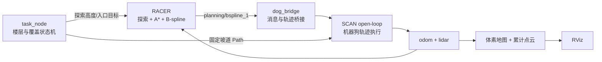

# dog-explor

面向四足机器人的 ROS 2 多层建筑自主探索、建图与测绘框架。项目将无人机 RACER 探索算法移植到机器狗平台，并通过分层任务状态机把单层覆盖探索、楼梯入口避障规划、预设坡道爬楼和新楼层恢复探索串成完整闭环。

当前仿真场景包含 4 层（L0～L3）、16 个柱体和 3 段连接坡道。正式任务要求每层覆盖率达到 85% 且稳定保持 5 秒后，才允许进入下一层。

## 技术亮点

### 1. 四层自主探索状态机

每层均执行相同的 RACER 探索逻辑：

1. 锁定当前楼层的机器狗身体高度。
2. 执行单块往复式覆盖探索，减少前沿目标反复切换造成的来回绕行。
3. 统计当前楼层独立覆盖率。
4. 覆盖率达标后规划至指定楼梯入口。
5. 沿预设坡道轨迹爬楼、确认落地，再重置下一层的探索与覆盖状态。

### 2. 考虑墙体遮挡的覆盖率

覆盖统计使用逐条激光射线更新：只有传感器与目标栅格之间射线可达的区域才计为已观测，墙后区域不会因为落在雷达量程内而被错误标记。覆盖率按楼层独立清零，避免低层扫描到上层结构后连续触发跨层。

### 3. 柱体避障与在线安全重规划

RACER 使用占据栅格、几何 A* 和 B 样条轨迹生成。规划轨迹与已建图的墙体、柱体发生冲突时，安全检查会从当前执行状态重新规划绕行路径，而不是继续执行穿障直线。

### 4. 连续平滑的轨迹衔接

机器狗执行到当前扫掠轨迹约 75% 时提前请求下一段轨迹。新轨迹从当前 B 样条的预测位置、速度和加速度开始，实现 C2 连续衔接，减少“走完一段—停车等待—再启动”的卡顿。

### 5. 规划式进楼梯口 + 预设直线爬楼

跨层过程采用明确的职责分离：

- 探索终点到楼梯入口：由 RACER 在当前楼层高度上规划，绕开墙体和柱体。
- 真正爬楼：到达入口后暂停 RACER，由预设的直线坡道轨迹接管。
- 坡顶落地：同时检查水平距离和 odom 高度，确认落地后才恢复下一层探索。

这种方式保留了入口段的动态避障能力，同时避免三维乐观规划把未知楼板当作自由空间，导致机器狗悬空“飞”到上层。

### 6. 多层地图与 RViz 展示

- 12 m 高度的三维体素地图覆盖完整建筑。
- 累计点云持续记录地板、柱体、坡道和楼梯结构。
- RViz 同时提供机器狗跟随视角与全局探索总览配置。

## 系统架构



## 仓库结构

```text
dog-explor/
├── src/dog_bridge/
│   ├── src/
│   │   ├── dog_bridge_node.cpp     # RACER/SCAN 消息与轨迹桥接
│   │   ├── task_node.cpp           # 多楼层任务状态机
│   │   └── cloud_accumulator.cpp   # 多层累计点云
│   ├── launch/
│   │   ├── plan_b.launch.py        # RACER + SCAN + RViz 一体化仿真
│   │   └── plan_b.rviz             # 演示用 RViz 布局
│   └── config/
│       └── layered_targets.yaml    # 楼层高度、坡道和正式阈值
└── docs/                            # 设计、检查点与验证记录
```

## 环境与依赖

- Ubuntu 22.04
- ROS 2 Humble
- PCL、Eigen、NLopt 及两个规划工作空间所需的 ROS 依赖
- 修改后的 [RACER-ROS2](https://github.com/SYSU-STAR/RACER)
- SCAN-Planner-Ros2 机器狗执行工作空间

推荐目录布局：

```text
/home/<user>/
├── dog_explor/
└── dog_racer/
    ├── RACER-ROS2/
    └── SCAN-Planner-Ros2/
```

本仓库是任务编排与桥接工作空间；RACER 和 SCAN 的配套修改文件索引见 [`docs/CHECKPOINT_2026-08-17.md`](docs/CHECKPOINT_2026-08-17.md)。当前 launch 文件使用 `/home/sigma/dog_racer` 下的仿真地图，部署到其他机器时需要同步修改 `plan_b.launch.py` 中的地图路径。

## 获取与构建

```bash
git clone https://github.com/Zxbxdxd/dog-explor.git dog_explor
cd dog_explor

source /opt/ros/humble/setup.bash
source /home/sigma/dog_racer/RACER-ROS2/install/setup.bash
source /home/sigma/dog_racer/SCAN-Planner-Ros2/install/setup.bash

colcon build --symlink-install --packages-select dog_bridge
source install/setup.bash
```

## 启动正式四层仿真

先在终端加载三个工作空间：

```bash
source /opt/ros/humble/setup.bash
source /home/sigma/dog_racer/RACER-ROS2/install/setup.bash
source /home/sigma/dog_racer/SCAN-Planner-Ros2/install/setup.bash
source /home/sigma/dog_explor/install/setup.bash
```

再启动完整仿真。项目测试与演示始终启用 RViz：

```bash
ros2 launch dog_bridge plan_b.launch.py \
  rviz:=true \
  coverage_metrics:=true \
  multi_floor:=true \
  layered:=true \
  coverage_threshold:=85.0 \
  coverage_hold_sec:=5.0 \
  explore_time_sec:=360.0
```

关键参数：

| 参数 | 正式值 | 说明 |
|---|---:|---|
| `rviz` | `true` | 启动 RViz 可视化 |
| `multi_floor` | `true` | 启用完整建筑高度地图 |
| `layered` | `true` | 启用逐层探索状态机 |
| `coverage_threshold` | `85.0` | 当前楼层切换覆盖率 |
| `coverage_hold_sec` | `5.0` | 覆盖率连续达标保持时间 |
| `explore_time_sec` | `360.0` | 覆盖率无法达标时的安全超时 |

> `coverage_threshold:=20.0` 只用于开发阶段的快速跨层回归，不能用于正式演示或验收。

## 仿真观察重点

在 RViz 和终端日志中应依次看到：

1. 当前楼层高度锁定，例如 L0 为 `z=0.50`。
2. RACER 执行往复式探索并持续提高本层覆盖率。
3. 覆盖率达到 85% 并保持 5 秒。
4. RACER 规划至坡道入口，入口段高度保持当前楼层不变。
5. 固定坡道路径接管后 odom 高度沿坡面连续上升。
6. 到达新楼层后更新高度并重新开始该层探索。

## 当前状态

- 四层探索框架与三次跨层状态机已跑通。
- 正式覆盖率配置为 85%，目标覆盖率可进一步调到约 90%。
- L0～L3 使用相同的单层 RACER 探索逻辑。
- 当前重点是继续提高复杂遮挡区域的最终覆盖率与真机参数鲁棒性。

## License

`dog_bridge` 包采用 Apache-2.0。引用或再发布 RACER、SCAN 相关代码时，请同时遵守对应上游项目的许可证。
