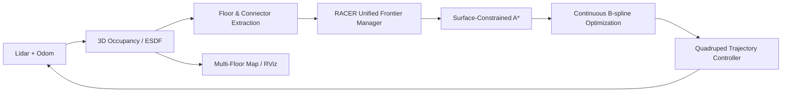

# dog-explor

RACER-Native Multi-Floor Exploration for Quadruped Robots

`dog-explor` 面向四足机器人在多层建筑中的自主探索、建图与测绘任务。项目目标是在 RACER 内部统一完成自由空间探索、跨层通道发现、楼梯/坡道通行和全局覆盖终止，使机器人从起点出发后无需人工指定楼层切换时机，即可连续完成整栋建筑的探索。

> 本文描述项目的目标技术架构。当前仓库提供多层仿真、地图、轨迹执行和核心模块验证框架，RACER 原生跨层决策正在按下述路线集成。

## 核心目标

- 单个 RACER 探索进程贯穿整个任务生命周期
- 自动发现楼层、坡道和楼梯连接关系
- 自主决定继续本层探索或进入下一层
- 轨迹始终约束在可通行表面，禁止穿楼板和悬空飞行
- 平层、进楼梯、爬楼和落地使用统一滚动规划框架
- 考虑墙体遮挡的激光覆盖统计
- 四层地图统一融合，最终覆盖率达到 85%～90%

## 技术路线

### 1. 在线分层地图

系统从激光点云、里程计和三维占据地图中提取局部可通行表面，通过高度直方图和平面聚类形成动态楼层集合：

```text
3D Occupancy / ESDF
        ↓
Ground Surface Extraction
        ↓
Layered 2.5D Traversability Map
        ↓
Floor Topological Graph
```

每个楼层维护独立的可通行栅格、未知边界和覆盖率，所有楼层共享一个全局三维地图。

### 2. 跨层 Frontier

普通未知区域被建模为 exploration frontier；具有连续高度梯度、足够宽度和可通行净空的坡道或楼梯入口被建模为 transition frontier。两类候选统一进入 RACER 的目标选择器，不再由外部节点发布“开始爬楼”指令。

候选目标的综合效用为：

```text
U(v) = wg·InformationGain(v)
     - wt·TravelTime(v)
     - wr·RevisitCost(v)
     - ws·CollisionRisk(v)
     - wy·HeadingChange(v)
     + wc·TransitionGain(v)
```

随着当前楼层的剩余信息增益下降，跨层候选的收益通过连续权重逐渐上升。楼梯入口会自然成为最优 frontier，实现探索行为向跨层行为的连续过渡。

### 3. 自动楼梯与坡道识别

连接区域需要同时满足：

- 地面高度沿主方向连续变化
- 坡度或台阶高度位于机器狗可通行范围
- 通道宽度和顶部净空满足机体包络
- 入口与另一高度层的自由空间连通
- 多帧观测结果具有足够置信度

识别结果作为带方向和高度变化的边加入楼层拓扑图。对尚未完全观测的上层落点，规划器只允许沿已确认的连接表面扩展，不允许直接在未知空间中进行垂直捷径搜索。

### 4. 表面约束运动规划

平层运动使用 2.5D 几何 A*；进入连接区域后使用表面约束的三维搜索。轨迹高度必须满足：

```text
zrobot = hground(x, y) + hbody
```

其中 `hground` 来自局部地面模型，`hbody` 为机器狗身体离地高度。搜索节点还需满足坡度、曲率、足端净空和占据栅格约束，从规划层面排除悬空、穿楼板和直接飞向上层的轨迹。

### 5. 连续滚动重规划

RACER 执行当前 B 样条轨迹约 75% 时，提前计算下一段轨迹。新轨迹继承当前执行轨迹的预测位置、速度和加速度：

```text
pnew(0) = pcurrent(t)
vnew(0) = vcurrent(t)
anew(0) = acurrent(t)
```

这样平层绕障、进入坡道、爬升和落地可以保持 C2 连续，避免机器狗在每段路径之间停车等待。

### 6. 遮挡感知覆盖率

覆盖统计采用逐条激光射线验证。只有传感器与目标栅格之间射线可达的区域才记为已观测；被墙体或柱体遮挡的区域仍保持未知。每个楼层独立累计覆盖率，全局终止条件为：

```text
all reachable frontiers exhausted
and coverage(floor_i) >= target, for every floor_i
```

### 7. 自主恢复策略

当局部轨迹被新障碍阻断、连接区域置信度下降或楼梯入口不可达时，RACER 将候选目标降权并回到全局 frontier 集合重新选择，而不是进入独立的人工恢复流程。

## 目标系统架构



RACER 内部始终执行同一套“感知—候选生成—效用评估—局部规划—轨迹执行”闭环。平层探索和跨层探索只是候选几何属性不同，不需要外部楼层状态机切换任务。

## 仿真场景

当前四层仿真场景包含：

- L0～L3 四个可探索楼层
- 16 个柱体障碍物
- 3 段连接坡道
- 三维激光建图与遮挡区域
- 机器狗 URDF 和跟随视角
- RViz 全局地图与实时规划轨迹

## 仓库结构

```text
dog-explor/
├── src/dog_bridge/
│   ├── src/                 # RACER/执行器桥接与实验控制节点
│   ├── launch/              # 一体化仿真与 RViz 配置
│   └── config/              # 地图、楼层和轨迹参数
└── docs/                    # 设计与验证记录
```

## 环境依赖

- Ubuntu 22.04
- ROS 2 Humble
- RACER-ROS2
- SCAN-Planner-Ros2
- PCL、Eigen、NLopt

推荐工作空间布局：

```text
/home/sigma/
├── dog_explor/
└── dog_racer/
    ├── RACER-ROS2/
    └── SCAN-Planner-Ros2/
```

## 构建

```bash
git clone https://github.com/Zxbxdxd/dog-explor.git dog_explor
cd dog_explor

source /opt/ros/humble/setup.bash
source /home/sigma/dog_racer/RACER-ROS2/install/setup.bash
source /home/sigma/dog_racer/SCAN-Planner-Ros2/install/setup.bash

colcon build --symlink-install --packages-select dog_bridge
source install/setup.bash
```

## 启动四层仿真

加载环境：

```bash
source /opt/ros/humble/setup.bash
source /home/sigma/dog_racer/RACER-ROS2/install/setup.bash
source /home/sigma/dog_racer/SCAN-Planner-Ros2/install/setup.bash
source /home/sigma/dog_explor/install/setup.bash
```

启动正式覆盖率配置，并始终打开 RViz：

```bash
ros2 launch dog_bridge plan_b.launch.py \
  rviz:=true \
  coverage_metrics:=true \
  multi_floor:=true \
  layered:=true \
  coverage_threshold:=85.0 \
  coverage_hold_sec:=5.0 \
  explore_time_sec:=360.0
```

| 参数 | 正式值 | 说明 |
|---|---:|---|
| `rviz` | `true` | 启动实时可视化 |
| `multi_floor` | `true` | 使用完整多层三维地图 |
| `layered` | `true` | 启用当前跨层仿真验证流程 |
| `coverage_threshold` | `85.0` | 单层目标覆盖率 |
| `coverage_hold_sec` | `5.0` | 覆盖率稳定时间 |
| `explore_time_sec` | `360.0` | 单层安全超时 |

> `coverage_threshold:=20.0` 仅用于快速跨层回归，不用于正式演示或验收。

## 实施里程碑

1. 单层遮挡感知覆盖探索与连续重规划
2. 多层地图和独立楼层覆盖统计
3. 在线楼层与连接区域提取
4. transition frontier 与统一效用函数
5. 表面约束 A* 和坡道 B 样条优化
6. 四层端到端自主探索验证
7. 真机坡度、净空与足端安全参数标定

## License

`dog_bridge` 包采用 Apache-2.0。RACER 和 SCAN 相关组件遵循其各自上游项目许可证。
